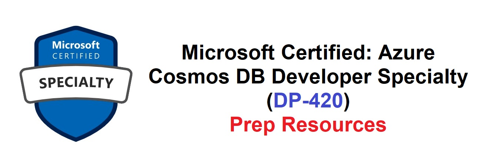

# Microsoft Certified: Azure Cosmos DB Developer Specialty certification materials
A GitHub repo with materials for preparing for DP-420: Microsoft Certified: Azure Cosmos DB Developer Specialty certification Exam.

## Aimed at Job roles:
Developer, Data Engineer, Solution Architect

### What do you need to pass this Exam?
As a candidate for this exam, you need solid knowledge and experience developing apps for Azure and working with Azure Cosmos DB database technologies. You should also be proficient at developing applications by using the Core (SQL) API and software development kits (SDKs), writing efficient queries, and creating appropriate index policies. You need experience provisioning and managing resources in Azure and creating server-side objects with JavaScript. Plus, you need to be able to interpret JSON, read C# or Java code, and use PowerShell.

## Course Outline:
Official course outline can be downloaded here > [Skills Measured](https://query.prod.cms.rt.microsoft.com/cms/api/am/binary/RWN6ga)

## Note:
Most questions cover features that are General Availability (GA). The exam may contain questions on Preview features if those features are commonly used.

# Resources:
Different resources are available for preparing, which have been categorized as such:
Date Last modified: 5 Jan 2022.

## Microsoft Sources:
- Foundations of Azure Cosmos DB with Dr. Leslie Lamport (Alan Turing Award Winner) > https://www.youtube.com/watch?v=Yfmw7swCtZs
- Microsoft Learn modules for DP-420 > https://docs.microsoft.com/en-us/users/23110622/collections/0kjyhppe5g5m0g?WT.mc_id=Azure_blog-wwl
- Microsoft Github repo for .NET SDK & Java SDK Labs > https://azurecosmosdb.github.io/labs/
- Microsoft Training Partner-led training (Course DP-420T00) > https://docs.microsoft.com/en-us/learn/certifications/courses/dp-420t00
- ChangeFeed Lab #1 > Retail real-time data analysis visualization; Github code > https://bit.ly/33YUbxr
- ChangeFeed Lab #2 > Movie retail store re-architecture; Github code > https://bit.ly/3HnXpsX
- Download and develop locally > Azure Cosmos DB Emulator > https://docs.microsoft.com/en-us/azure/cosmos-db/local-emulator?tabs=ssl-netstd21
- Azure Cosmos DB Comprehensive Overview (2018) > https://docs.microsoft.com/en-us/shows/Level-Up/Azure-Cosmos-DB-Comprehensive-Overview
- Ask the Experts: Build cloud native apps of any scale with Azure Cosmos DB - BUILD 2021 (Jan5, 2022) > https://www.youtube.com/watch?v=HUt6n0dHSOk

## Microsoft Sources (YouTube Videos for Concepts):
- Azure Cosmos DB Live TV > https://www.youtube.com/playlist?list=PLmamF3YkHLoKMzT3gP4oqHiJbjMaiiLEh
- Azure Cosmos DB Tips & Tricks > https://www.youtube.com/playlist?list=PLmamF3YkHLoJtbZZeLUtZvkVnhQjrnI2V

## Azure Community Sources:
- Thomas Maurer Study Guide > https://www.thomasmaurer.ch/2021/10/dp-420-study-guide-microsoft-azure-cosmos-db-developer/
- Gregor Suttie Study Guide > https://gregorsuttie.com/2021/10/18/azure-exam-dp-420-study-guide-designing-and-implementing-cloudnative-applications-using-microsoft-azure-cosmos-db-beta/

## Pluralsight:
- Learning Azure Cosmos DB > https://app.pluralsight.com/library/courses/azure-cosmos-db/table-of-contents
- Data Modeling & Partioning Patterns > https://app.pluralsight.com/library/courses/data-modeling-partitioning-patterns-azure-cosmos-db/table-of-contents
- Event-driven Microservices with Cosmos DB Change Feed > https://app.pluralsight.com/library/courses/building-event-driven-microservices-azure-cosmos-db-change-feed/table-of-contents

## Udemy:
- Learn Azure Cosmos DB basics this weekend > https://www.udemy.com/course/azure-cosmosdb/

## Feedback
You can share any feedback at: sugh AT microsoft dot com

## License & Terms of Use

This is a free white paper released into the public domain.
Anyone is free to use or distribute this white paper, for any purpose, commercial or non-commercial, and by any means.

THE WHITE PAPER IS PROVIDED "AS IS", WITHOUT WARRANTY OF ANY KIND, EXPRESS OR IMPLIED, INCLUDING BUT NOT LIMITED TO THE WARRANTIES OF MERCHANTABILITY, FITNESS FOR A PARTICULAR PURPOSE AND NONINFRINGEMENT.
